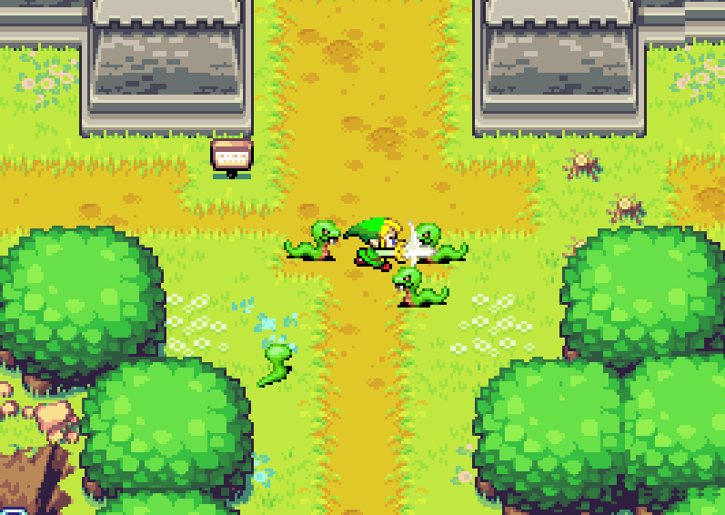

# 2D Zelda

 

 

## Ⅰ. 프로젝트 소개

### 개요

- Window API를 사용해 프레임워크 및 오브젝트 설계, 리소스 관리, 충돌 처리, 카메라, UI, 애니메이션 등 게임에 필요한 기능을 직접 구현

 

### 기간 및 인원

- 2025.03.24 ~ 2025.04.03 (약 2주)
- 1인

 

## Ⅲ. 기술 스택

### Tools

- Visual Studio 2022
- Window API

### Language

- C++

 
